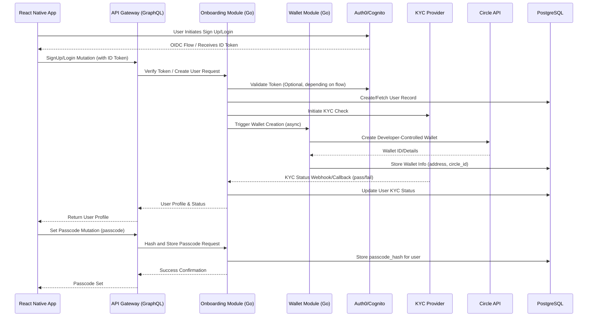
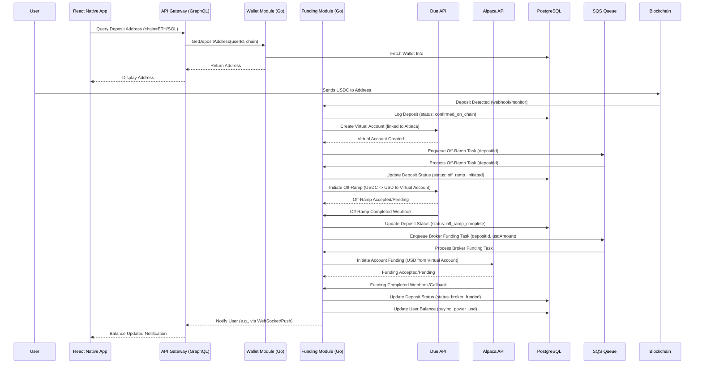
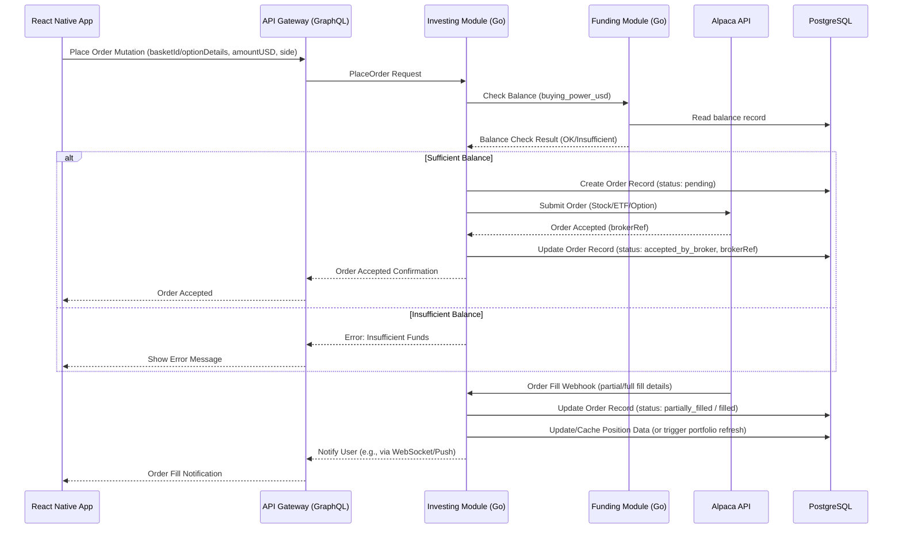
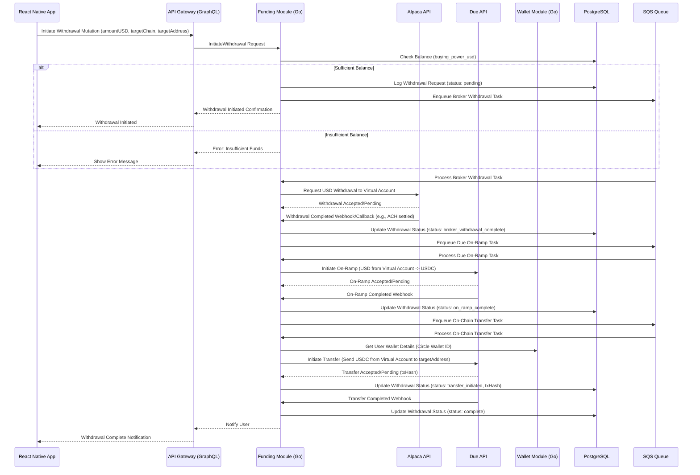

# Core Workflows

**Version:** v0.2  
**Last Updated:** October 24, 2025

## Navigation
- **Previous:** [Components](./03-components.md)
- **Next:** [Database Schema](./05-database-schema.md)
- **[Index](./README.md)**

---

## 7. Core Workflows

These sequence diagrams illustrate the key interactions between components and external partners for critical user journeys in the Go-based architecture.

### 7.1 Onboarding + Wallet Creation + Passcode Setup

### 7.2 Funding Flow (USDC Deposit -> Circle Off-Ramp -> Alpaca Funding)

### 7.3 Investment Flow (Place Order for Stock/Option via Alpaca)

### 7.4 Withdrawal Flow (Alpaca USD -> Circle On-Ramp -> USDC Transfer)

---

**Next:** [Database Schema](./05-database-schema.md)
