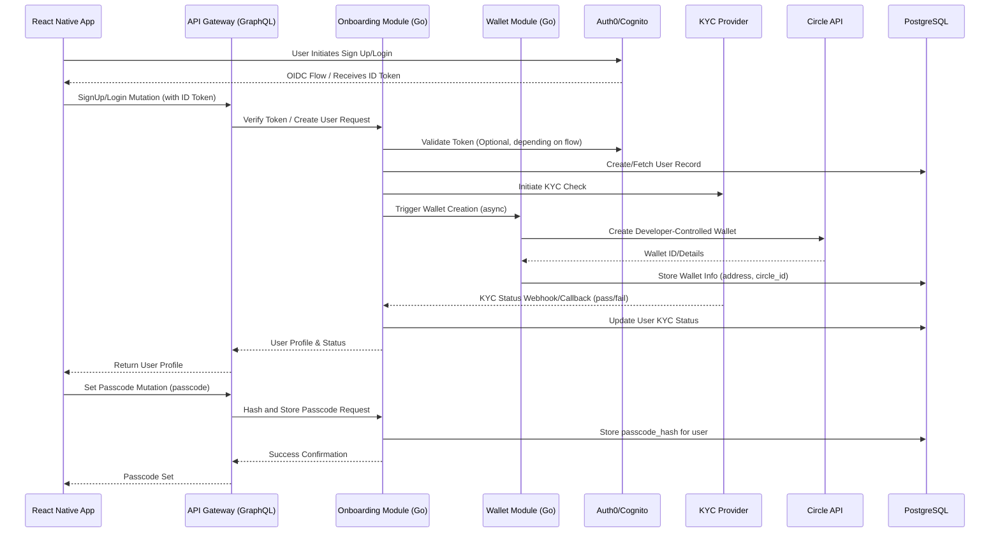
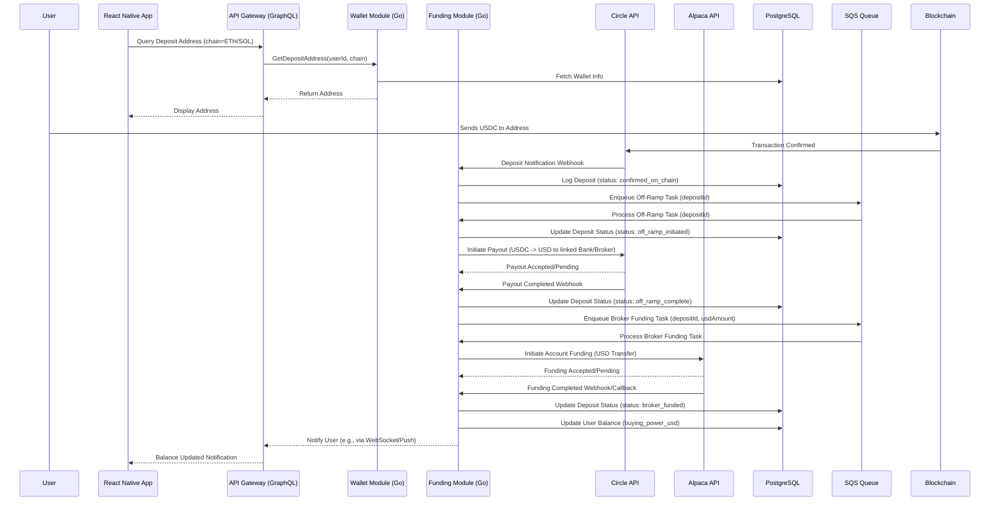
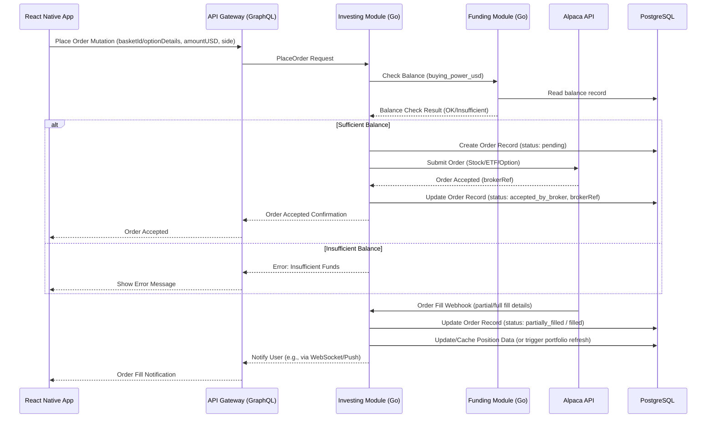
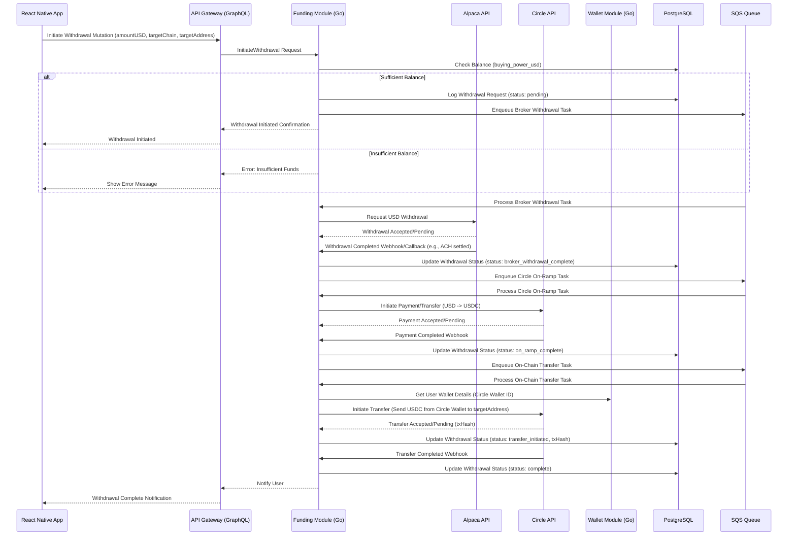

# 7\. Core Workflows

These sequence diagrams illustrate the key interactions between components and external partners for critical user journeys in the Go-based architecture.

### 7.1 Onboarding + Wallet Creation + Passcode Setup

### 7.2 Funding Flow (USDC Deposit -\> Circle Off-Ramp -\> Alpaca Funding)

### 7.3 Investment Flow (Place Order for Stock/Option via Alpaca)

### 7.4 Withdrawal Flow (Alpaca USD -\> Circle On-Ramp -\> USDC Transfer)

